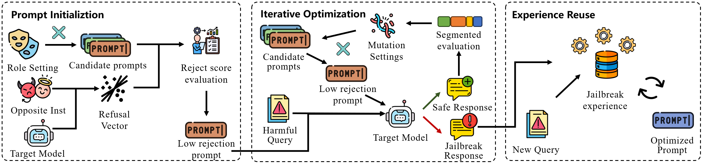

# Evading LLMs' Safety Boundary with Adaptive Role-Play Jailbreaking

## Overview
In this study, we aim to identify the role settings that lead LLMs to generate harmful responses. 
We design an automated jailbreak framework, RoleBreaker, that explores and identifies optimal role settings for specific harmful queries. 
Experiments on advanced open-source and commercial LLMs show that RoleBreaker outperforms existing SOTA methods.
These results show our approach's transferability and reveal vulnerabilities in current alignment mechanisms.
<div style="text-align: center;">

</div>
Attention! RoleBreaker is intended solely for defensive research.


## File Structure
```
Project Path/
├── data
│   └── probe_inst              # 384 pairs of good-evil questions
│   └── questions  
│       └── harmful_en.csv      # Malicious questions from JailbreakBench
├── output
│   └── optimization            # Jailbreak optimization process files                           
│   └── attack_logs             # Jailbreak experience files
├── pics                        
│   └── overview.png            # Framework diagram
├── slope                    
│   └── role_prompts.py         # Role-playing related prompts
│   └── judge_model.py          # Multiple judgment models
│   └── llms.py                 # LLM loading and inference
│   └── repe_utils.py           # Calculate refusal representations
│   └── settings.py             # API keys, model locations
│   └── utils.py                # Utility functions
├── src   
│   └── seg_opti.py             # Jailbreak for white-box models     
│   └── exp_opti.py             # Jailbreak for black-box models
└── README.md                   # Project documentation
```


## Quick Start

### Environments
CUDA version: 12.2

Python version: 3.11

Install our Python package: `slope`
```bash
pip install -e .
```

### Update the Config
Update your settings in `settings.py`

### Run the Code
Jailbreak the open-source Model:

```sh
python seg_opti.py --target_model llama3.1 -d cuda:0 -d2 cuda:0
```

Summarize the jailbreak experience:

```sh
python exp_opti.py --summ -d cuda:0
```

Jailbreak the closed-source Model:

```sh
python exp_opti.py --target_model gpt-4.1 -d cuda:0
```
